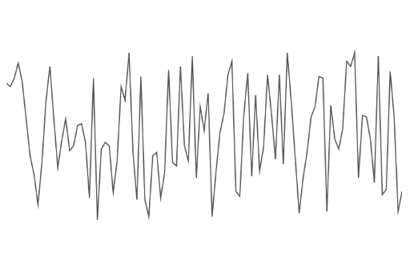
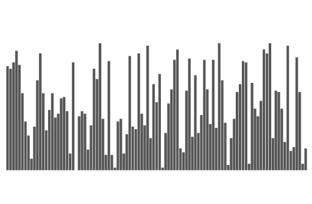

# MinChartKit
📈 Easily Create Hyper-Minimal Charts 📊

## Usage
All charts are created throught the ``MinChartKit`` struct, by first injecting the data:

```swift
let data = [1.0,3.0,5.0,7.0,3.0,...]
let minChartKit = MinChartKit(data:data)
```

Then calling the type of chart you want to make with the data and passing that chart as a parameter:

```swift
...
let minLine = (pull from storyboard)
minChartKit.line(minLine)
```

As noted above, the ``MinLine`` or ``MinBar`` charts can be used in your storyboard and connected through an ``@IBOutlet``.


You can also inject a color for your chart on instantiation of the ``MinChartKit`` ``struct``:

```swift
...
let minChartKit = MinChartKit(data:data, color:.blue)
minChartKit.bar(minBar)
```

## Supported Charts

### ``MinLine``



### ``MinBar``



## Installation
The easiest way to use *MinChartKit* is with CocoaPods

### Installation with CocoaPods
To integrate *MinChartKit* into your Xcode project using CocoaPods, specify it in your `Podfile`:

```ruby
platform :ios, '11.0'

target 'TargetName' do
  pod 'MinChartKit', :git => 'https://github.com/stevewight/MinChartKit.git'
end
```

Then, run the following command:

```bash
$ pod install
```

## Pre-Release Version
This is a pre-release version of *MinChartKit* and although it is stable and should be working in all the above cases, things will be added, changed and potentially break.

## License
*MinChartKit* is released under an **MIT** license.  So use it how ever you want.
